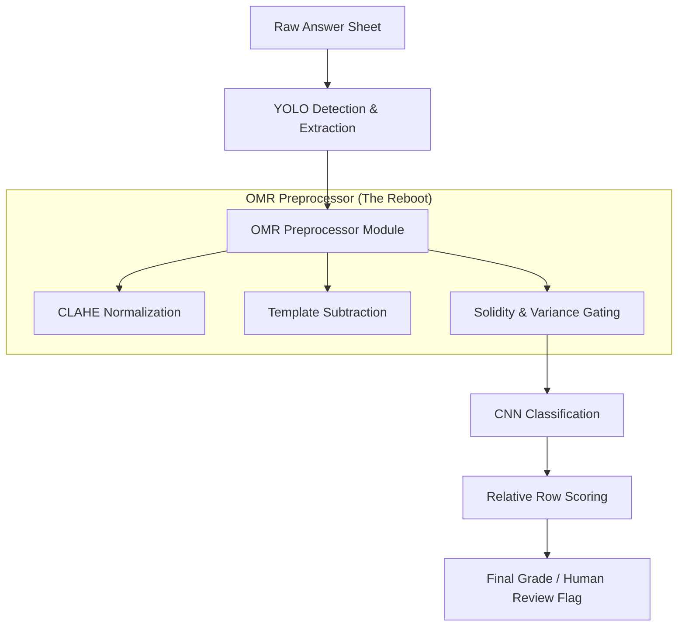

# 🏗️ Technical Architecture: The "Secret Sauce" Reboot

## 🔄 The Pipeline Evolution
The Phase 2 Reboot centralizes the image logic to ensure 100% consistency between training and inference.

## 🛠️ Key Technical Modules

### 1. OMR Preprocessor (`preprocessing.py`)
- **CLAHE:** Custom contrast equalization to handle varied lighting.
- **Template Subtraction:** Removes the printed ring/letter (A-E) to isolate the ink.
- **Solidity Gating (0.72):** Detects "hollow" letter shapes to prevent them from being classified as "filled."
- **Inner Masking (0.78x):** strictly analyzes the inner core of the bubble.

### 2. Classification Strategy (Hybrid)
Current reboot target is **binary classification** with an uncertainty review bucket:
- **`blank`** and **`filled`**, with **`uncertain`** routed to review.

Planned upgrade path after two stable binary cycles:
- Expand to **`crossed`** and **`invalid`** for 4-class scoring.

### 3. Model Strategies
- **MobilenetV2:** Used for high-efficiency, industrial-grade texture recognition.
- **Diamond CNN:** A custom PyTorch architecture designed for complex texture abstraction.
- **Ascending CNN:** Progressive feature hierarchy for robust binary bubble separation.
- **Transfer Learning (ResNet18):** Pretrained backbone with a task-specific classification head for rapid adaptation.

### 4. Phase 3 Model Modularity
- **diamond.py:** Dedicated Diamond methodology implementation.
- **ascending.py:** Dedicated Ascending methodology implementation.
- **transfer_learning.py:** Dedicated Transfer Learning methodology implementation.
- **cnn_models.py:** Compatibility facade that re-exports all model classes for existing consumers.

## 📈 Performance Targets
- **Tilt Tolerance:** up to 20°
- **Ink Coverage:** 99.9% accuracy on standard black/blue ink and HB-3 pencils.
- **Processing Speed:** < 50ms per sheet (Post-extraction).
